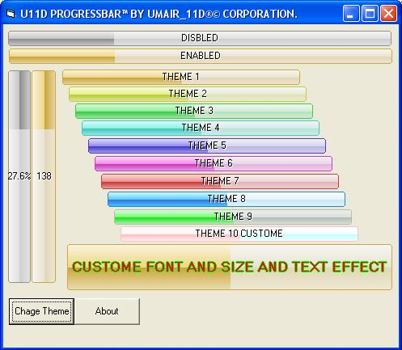



## U11D ProgressBar \(2007\)

### Description

After "STYLER BUTTON 2007" Project Complete I Work Start to U11D ProgressBar.

*** ONLY ZIP FILE SIZE 13KB ***

"U11D PROGRESSBAR" FEATURES:

----

1:10 THEMES SUPPORT.

2:BORDER ROUNDED.

3:ORIENTATION (HORIZONTAL/VERTICAL).

4:TEXT ALIGNMENTS.

5:TEXT EFFECTS.

6:TEXT STYLES(CUSTOME/VALUE/PERCENTAGE)

7:TEXT COLOR.

8:TEXT FONTS.

9:ENABLED/DISABLED SUPPORT

10:MORE FASTERS

11:BUGS FIXED.

12:CUSTOME SIZE.(HEIGHT NOT FIXED)

COMING SOON:(I AM WORKING IN THIS FEATURES).

----

1:MORE THEMES SUPPORT.

2:PROGRESSBAR THEMES CREATER SOFTWARE.(SAVE THEME CODE IN INI FILE).

3:READ THEMES IN INI FILE.

5:ROTATION SUPPPORT.

6:FILLING DIRECTION EFFECTs(RIGHT TO LEFT/LEFT TO RIGHT. etc).

7:CRYSTAL EFFECT DURING FILLING.(JUST LIKE VISTA).

8:MULTI STYLE TOOLTIP.

9:FADE FILLING EFFECT.

10:MORE FASTERS.

AND FULLY CUSTOMIZING...

MY QUESTION:

WHAT PROCEDURE TO TRANSPARENCY/OPACITY OF USERCONTROL?
 
### More Info
 

             |
---                |---
**Submitted On**   |2007-06-29 15:57:46
**By**             |[Muhammad Umair 11D](https://github.com/Planet-Source-Code/PSCIndex/blob/master/ByAuthor/muhammad-umair-11d.md)
**Level**          |Intermediate
**User Rating**    |5.0 (114 globes from 23 users)
**Compatibility**  |VB 5\.0, VB 6\.0
**Category**       |[Custom Controls/ Forms/  Menus](https://github.com/Planet-Source-Code/PSCIndex/blob/master/ByCategory/custom-controls-forms-menus__1-4.md)
**World**          |[Visual Basic](https://github.com/Planet-Source-Code/PSCIndex/blob/master/ByWorld/visual-basic.md)
**Archive File**   |[U11D\_Progr2073356302007\.zip](https://github.com/Planet-Source-Code/muhammad-umair-11d-u11d-progressbar-2007__1-68913/archive/master.zip)

